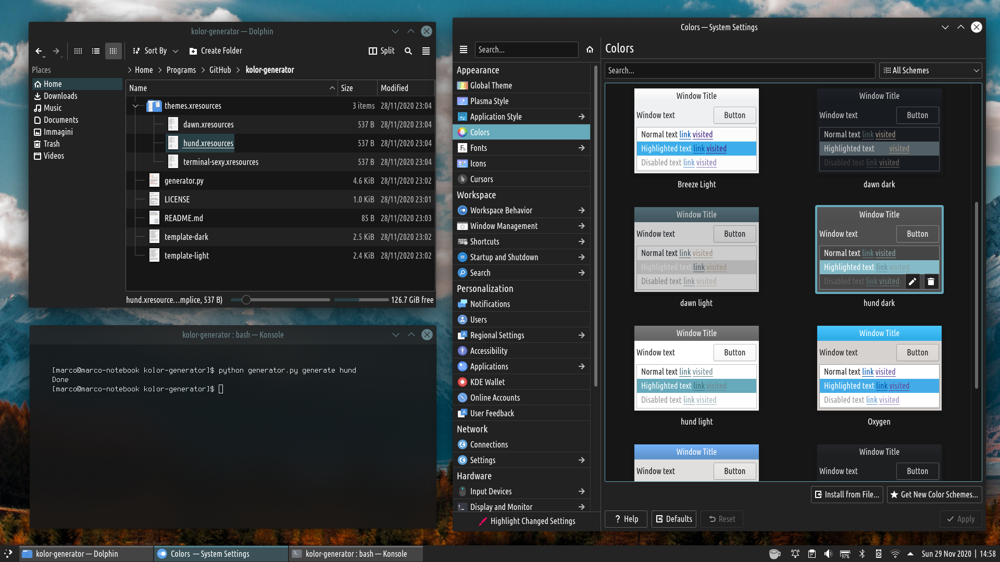

# kolor-generator

This script generates a KDE Plasma color scheme from an xresource color palette, like the ones you can generate from [terminal.sexy](https://terminal.sexy).

Requires [Python 3](https://www.python.org/).

# Basic usage

Clone this repository in a directory of your choice.

Place the color schemes in .xresources format in "themes.xresources/". Some demo schemes are already available in the folder.

Then **run the command**:

`python generator.py generate-all`

This will generate a Plasma color theme for each .xresources file and will place them in `~/.local/share/color-schemes/`. Now you just need to go to *System Settings -> Colors* to select the color scheme just created.

If you want to generate the color scheme **just for one specific .xresources file**, run:

`python generator.py generate FILENAME` (without .xresources)

If you want to generate a **light color scheme**, put `-l` at the end of the command:

`python generator.py generate-all -l`

# How does it (simply) work

The script uses the two files "template-dark" and "template-light" to generate respectively dark and light schemes. 

It does so by replacing each color with the closest color from the palette obtained from the .xresources file.

This means that the colors in the template affect the final result, which depends also on the number and variety of colors in the .xresources file palette.
